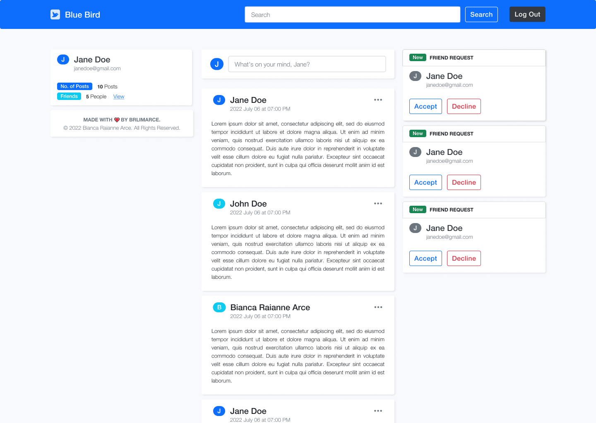

<!-- Banner -->

<!-- Header -->

  <h1><b>🐦 Blue Bird</b></h1>
  
A social media platform on ReactJS and MongooseJS that resembles an <i>imitation</i> of Twitter and Facebook.

 

<!-- App Preview -->
## 📱&ensp;App Preview

<!-- Features -->
## ✨&ensp;Features
- **User authentication** and **authorization** includes **token creation** and **validation.**
- **View, add, edit,** and **delete** your **posts** in the platform.
- **Search** and **add** other users as **friends.** Then, you are able to *view* your **new friends' posts!**
